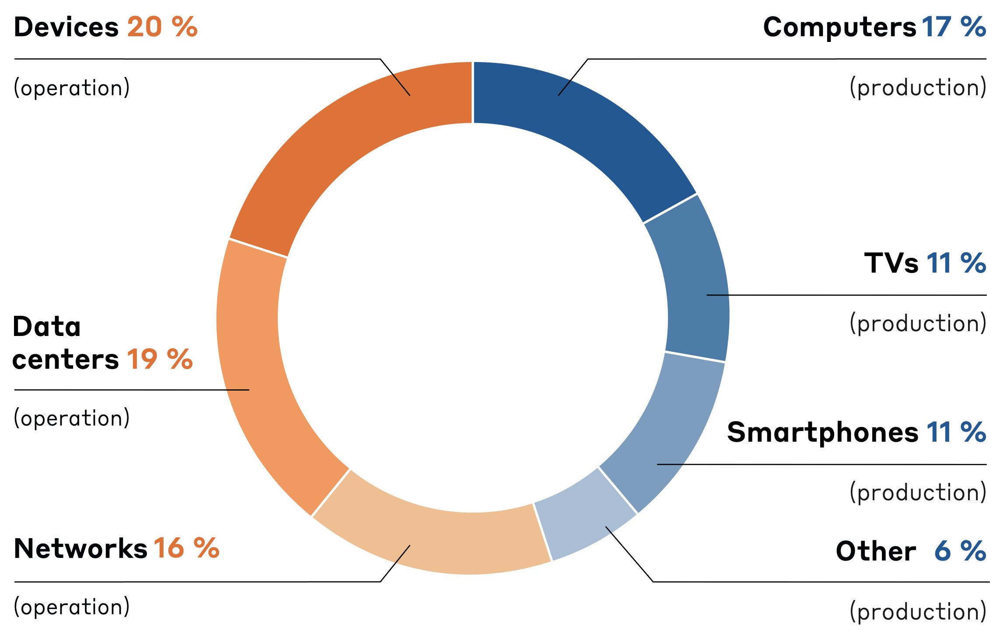
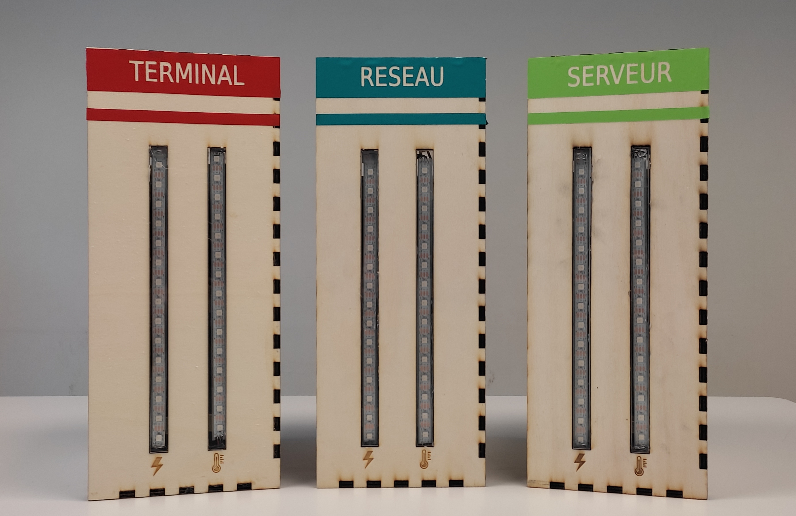
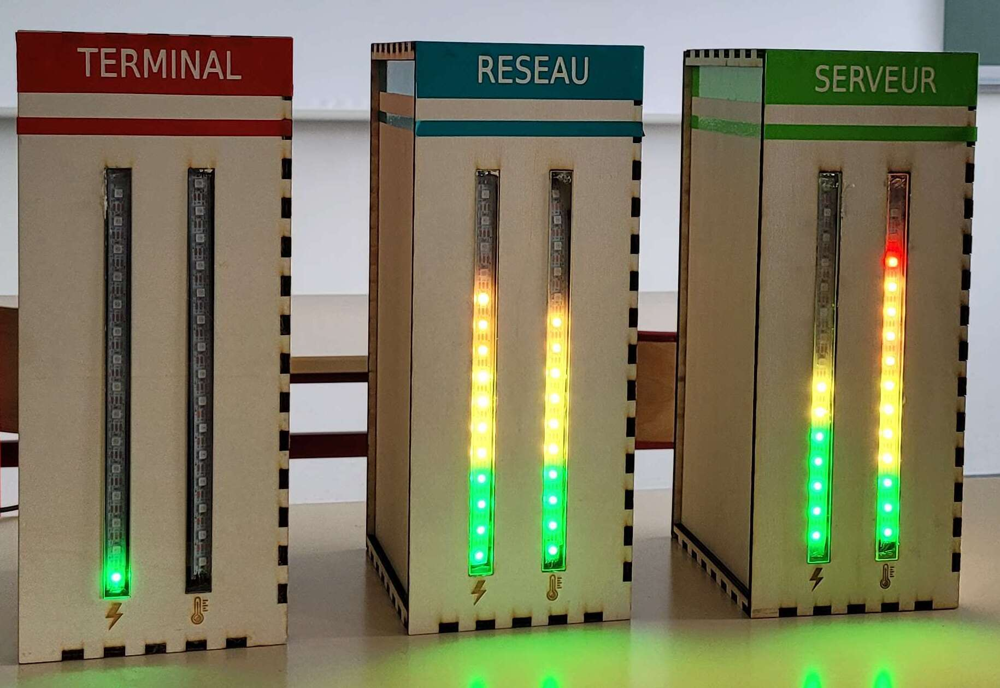

# Demoj

<div align="center"></div>

> Repository for the DemoJ project by DemoTech
> Made at the University of Rennes during 2023/2024

# Authors

- Alexandre Boutinaud (Scrum master)
- Arthur Adam (Scrum master)
- Olivier Palvadeau (In charge of documentation)
- Yasmine Tellache
- Hadrien Moulhérat
- Cameron Salomé
- Yann Lainé Odic
- Anaelle Daumand
- Charly Piaud

Under the supervision of Olivier Ridoux who taught and helped us a lot during this project.

# Contacts

For more information related to this project please contact :

- Arthur Adam 
- [Alexandre Boutinaud](https://fr.linkedin.com/in/alexandre-boutinaud)
- [Olivier Palvadeau](https://fr.linkedin.com/in/olivier-palvadeau-6ab04a2a4)
- Hadrien Moulhérat
- [Olivier Ridoux](http://www.irisa.fr/lande/ridoux/) (Teacher at the university of Rennes)

# Table of contents

- [Authors](#authors)
- [Contacts](#contacts)
- [Description](#description)
    - [About this project](#project-abstract)
    - [Branches description](#branches)
    - [Libraries and frameworks used](#libraries--frameworks)
    - [Reports and documents](#reports-and-docs)
    - [Setup](#setup)

# Description

## Project

When you are using your phone or computer, you are aware that your device is consuming energy since you will have to supply energy to your device. But what you can't directly see is the energy consumed by the servers and routers which your applications are communicating with. A lot of computations are delocalized while you are using your device and you get the results on it as well. But the real computation usually really happens out of your device. Applied to only one person with only one device this impact on the energy consumption is small but applied to a lot of people, bots, with multiple devices... the impact is more significant. 

With our project DemoJ we built a demonstrator of the energy consumed by using computer systems in order to raise awareness among an audience. DemoJ is a dynamic model of a computer system with the aim of being presented to an audience by an operator.
> DemoJ : Demo = Demonstrator, J = Joules

<div align="center">
<br><a url="https://theshiftproject.
org/en/article/implementing-digital-sufficiency/"><i>The Shift Project. Expanding digital sufficiency. 2021.</i></a>
</div>

The energy consumed by computer systems can be cut into 2 parts which have almost equal size : The production and the Operation. With DemoJ we focus on the operation part. In this part we can see 3 parts almost equal as well which describes a very common scheme of computer systems : Terminals (devices), Networks (Routers), Servers (Data-centers). We reused this 3 modules for our model with 3 boxes.

<div align="center"></div>

The 3 modules are connected through the Network box (Reseau in french) which behaves like a real wifi router. Each box has 2 led gauges : heat and energy.
The operator or the audience can interract with the model by playing different scenarios and see which module is the most impacted.
For now we have 3 scenarios :
- Calculator : to simulate costly calculations.
- Generative IA : to simulate interacting with an IA on the web like chatGPT.
- Video streaming : to simulate watching a video on internet like watching on youtube or an other platform.

It's also possible to stress only the terminal module in order to simulate playing an offline video game.

<div align="center"></div>

All the scenarios can be launched using the Web application on the DemoJ wifi at demoj.fr.

<div align="center"></div>

For more detailed description of the project please read the [reports and doculentations](#reports-and-docs)

## Branches

Our project is divided into 3 modules and one web application.

Each module has common code available in master branch. They also have their own code in their own branch (Network, Terminal or Server)
> Common code is also shared in module's branches.

The code for the web application is available into the common.


The master branch is used for documentation and common parts such as insallation scripts and elctronics.


## Libraries & frameworks

- DFRobot INA 219
- Rpi ws281x
- Flask
- VueJS
- Ionic

## Reports and docs

We made two reports for our projects available [here](/docs/reports)

You can see our circuit diagrams [here](/docs/circuit_diagrams) 

You can read the user documents [here](/docs/user/)

For any other document look [here](/docs)

## Setup
### As a user :

Please read the [user manual](/docs/user/Manual.pdf)

### As a developper, setup a module :
1. Download and install Raspberry OS Lite on your Raspberry Pi device :
    - By using [Raspberry Pi Imager](https://www.raspberrypi.com/software/) 
    - By using your own script

    Don't forget to enable ssh and connection before installing.

2. Launch and connect to your Raspberry Pi : ```ssh username@host.local```

3. Install git : ```sudo apt install git```

4. Clone our repository :  
    - HTTPS ```git clone https://github.com/alexxbout/demoj.git```
    - SSH ```git clone git@github.com:alexxbout/demoj.git```

5. Run the [setup.sh](/setup.sh) script to install dependencies and setup environment for the module (terminal, network or sevrer) you want. 
   - ```cd demoj ; cd scripts```
   - ```./setup.sh```
   - Choose your installation

7. Disconnect, and if the network module is also set up, you may have to disconnect your personal Wifi and use the DemoJ wifi instead.
