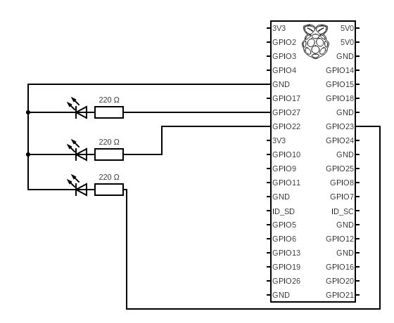

# Temperature display on leds

## Install

No libraries required to install since you already have installed Raspberry OS on your Raspberry Pi device.

## Wiring

Here is the blueprint 

## Run

    python main.py